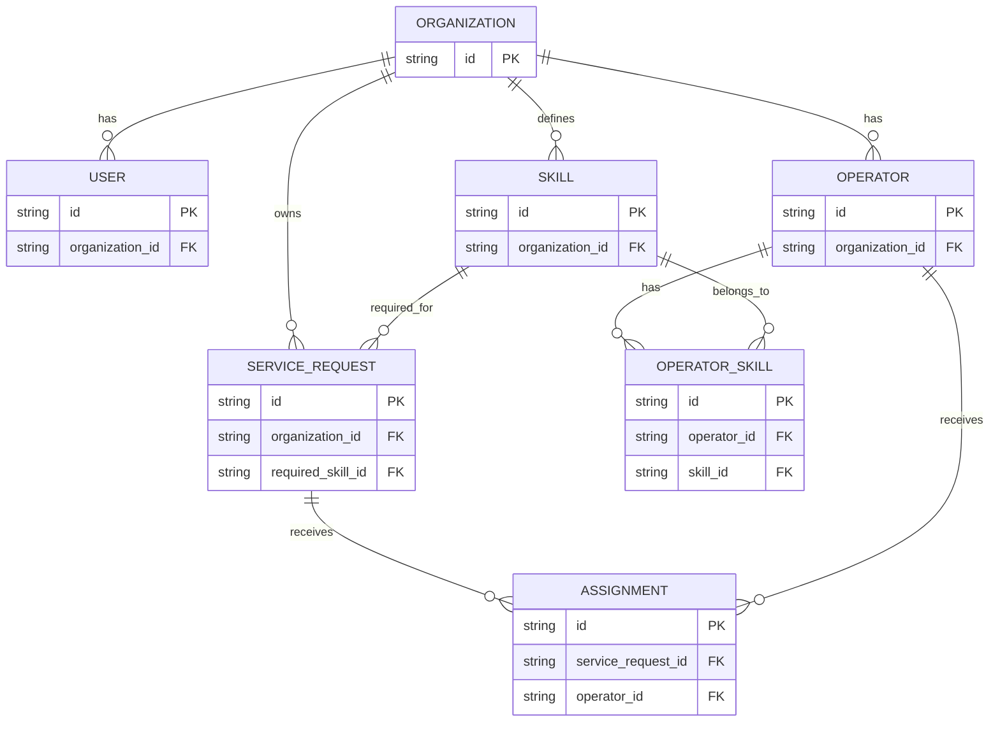

# PulseRoute Core Schema ERD

## Scope

This document covers the core database models:

- Organization
- User
- Operator
- Skill
- OperatorSkill
- ServiceRequest
- Assignment

Later tables for webhooks, routing decisions, deliveries, audit logs, queues, and authentication are intentionally excluded.

## Relationships

| Relationship                  | Type                  | Foreign key lives on | Required | On parent deletion | Why it exists                                         |
| ----------------------------- | --------------------- | -------------------- | -------- | ------------------ | ----------------------------------------------------- |
| Organization → User           | One-to-many           | User                 | Yes      | Restrict           | Keeps login accounts inside one organization          |
| Organization → Operator       | One-to-many           | Operator             | Yes      | Restrict           | Keeps each organization’s workforce separate          |
| Organization → Skill          | One-to-many           | Skill                | Yes      | Restrict           | Lets each organization manage its own skill list      |
| Organization → ServiceRequest | One-to-many           | ServiceRequest       | Yes      | Restrict           | Identifies which organization owns the request        |
| Operator → OperatorSkill      | One-to-many           | OperatorSkill        | Yes      | Cascade            | Records the skills an operator has                    |
| Skill → OperatorSkill         | One-to-many           | OperatorSkill        | Yes      | Restrict           | Connects an operator’s qualification to a valid skill |
| ServiceRequest → Assignment   | One-to-many over time | Assignment           | Yes      | Restrict           | Preserves the assignment history of a request         |
| Operator → Assignment         | One-to-many           | Assignment           | Yes      | Restrict           | Records which operator received an assignment         |
| Skill → ServiceRequest        | One-to-many           | ServiceRequest       | Yes      | Restrict           | Identifies the skill required by a request            |

## ERD

## Important rules

An `OperatorSkill` must not connect an operator from one organization to a skill owned by another organization.

An `Assignment` must not connect a service request from one organization to an operator from another organization.

Normal foreign keys prove that the referenced records exist. They do not automatically prove that both records belong to the same organization. We will handle that during the constraint design.
