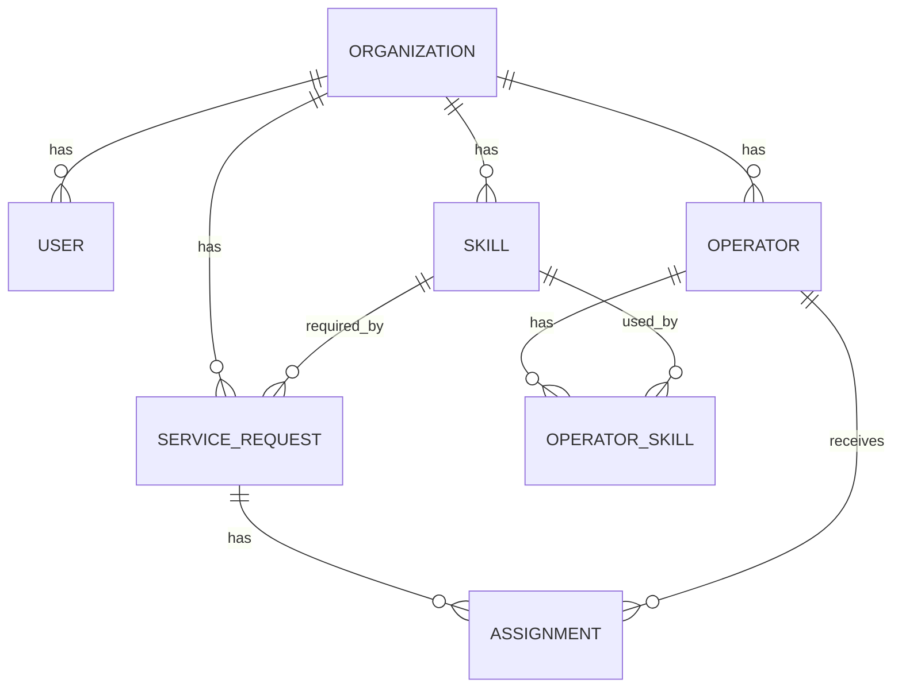
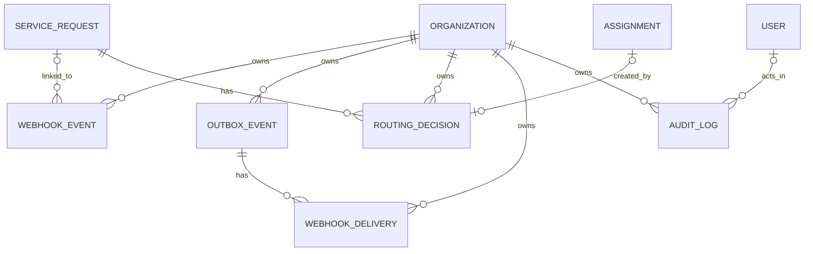

# PulseRoute Database ERD

## Scope

PulseRoute has 12 application tables:

- Organization
- User
- Operator
- Skill
- OperatorSkill
- ServiceRequest
- Assignment
- WebhookEvent
- OutboxEvent
- RoutingDecision
- WebhookDelivery
- AuditLog

`_prisma_migrations` belongs to Prisma and is not part of the app model.

Phase 3 only adds database storage. It does not run webhooks, routing, queues, retries, auth, or outbound requests.

## Core data

## Event and history data

## New Phase 3 tables

### WebhookEvent

Stores what an outside system sent to PulseRoute.

It keeps the raw request body, the parsed JSON when possible, its status, and the service request it created.

### OutboxEvent

Stores work that PulseRoute must do later.

A worker will use these rows in Phase 9. The table keeps the work state, retry count, next attempt time, payload, and latest error.

### RoutingDecision

Stores why routing picked an operator or found no valid match.

It links to the service request, keeps the scoring version, and stores the full decision details in JSONB.

### WebhookDelivery

Stores one outbound webhook attempt.

One outbox event can have many attempts. Each row keeps the attempt number, result, time, HTTP status, and error details.

### AuditLog

Stores important user and system actions.

It records who acted, what they did, which item they acted on, when it happened, and any extra details.

## Main rules

- Each row belongs to one organization.
- Cross-table links must stay inside the same organization.
- A service request is unique by organization and external ID.
- An operator cannot have the same skill twice.
- Skill levels must stay in the allowed range.
- Operator capacity must be greater than zero.
- Outbox attempt counts cannot be negative.
- Delivery attempt numbers must be greater than zero.
- A successful or failed delivery must have a completion time.
- An assigned routing decision must point to an assignment.
- An unroutable decision must not point to an assignment.
- A user audit row must name a user.
- A system audit row must not name a user.

The rule that only one active assignment may exist for a service request stays deferred to Phase 7.

## Why PostgreSQL

PulseRoute needs foreign keys, unique rules, transactions, and strong tenant checks.

PostgreSQL gives us those rules while JSONB lets us store payloads, routing details, errors, and audit data that do not always share one fixed shape.
